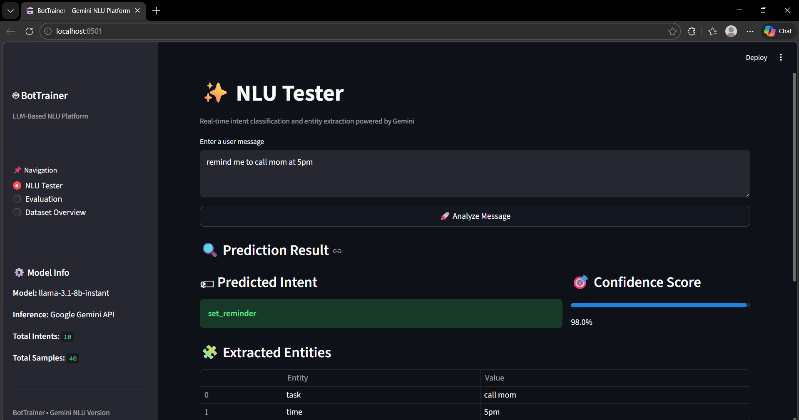
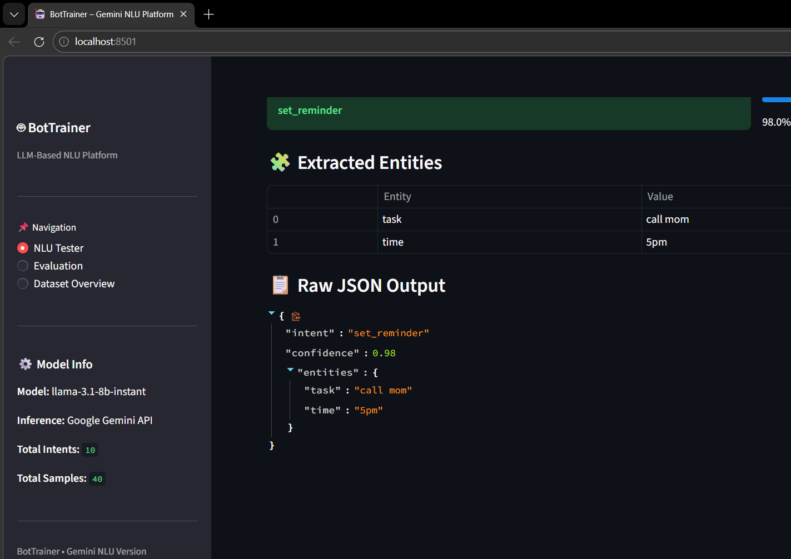
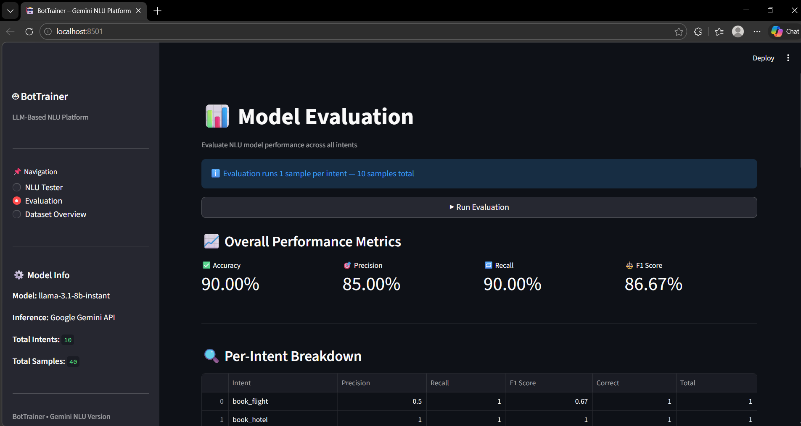

# 🤖 BotTrainer – LLM-Based NLU Model Trainer & Evaluator

**Natural Language Understanding (NLU)** system powered by **Groq API (LLaMA 3.1)** that classifies user intents and extracts entities using prompt engineering.

---

## 👨‍💻 Author
**Dan** 

---

## 🧠 What This Project Does

BotTrainer takes a user message like:
```
"Book a flight to Delhi tomorrow"
```

And returns:
```json
{
  "intent": "book_flight",
  "confidence": 0.95,
  "entities": {
    "location": "Delhi",
    "date": "tomorrow"
  }
}
```

No model training. No embeddings. Just smart prompt engineering with LLaMA 3.1 via Groq.

---

## 🚀 Key Features

- 🎯 Intent classification across 10 chatbot intents
- 🧩 Entity extraction using JSON schema
- 📊 Model evaluation — Accuracy, Precision, Recall, F1
- 🔀 Confusion matrix + per-intent breakdown
- 📁 Dataset overview with bar chart and pie chart
- 🖥️ Interactive Streamlit web interface
- 📝 Timestamped logging to file and console
- 🔐 Secure API key management via `.env`

---

## 🏗️ System Architecture
```
User Message
     ↓
prompt_template.py (builds few-shot prompt)
     ↓
Groq API → LLaMA 3.1 8B Instant
     ↓
Structured JSON Response
     ↓
Intent + Entities + Confidence
     ↓
Streamlit UI / Evaluator
```
---

## 🖼️ Screenshots

### 🧪 NLU Tester — Real-time Intent Prediction


### 🧩 Extracted Entities & Raw JSON Output


### 📊 Model Evaluation Dashboard

---

## 📦 Tech Stack

| Component | Technology |
|---|---|
| LLM | LLaMA 3.1 8B Instant via Groq |
| UI | Streamlit |
| Evaluation | scikit-learn |
| Data | pandas |
| Visualization | matplotlib |
| Config | PyYAML + python-dotenv |
| Logging | Python logging module |

---

## 🗂️ Project Structure
```
BOTTRAINER/
│
├── config/
│   └── config.yaml          # Model & path configuration
├── data/
│   └── raw_data/
│       ├── intents.json     # Core intent schema (10 intents)
│       └── nlu_dataset.csv  # 300-row synthetic dataset
├── logs/                    # Timestamped log files
├── src/
│   ├── components/
│   │   ├── gemini_nlu.py    # Groq LLM inference
│   │   ├── evaluator.py     # Metrics calculation
│   │   ├── json_loader.py   # Dataset loader & validator
│   │   └── json_to_dataframe.py
│   ├── pipeline/
│   │   └── main_pipeline.py # End-to-end evaluation pipeline
│   └── utils/
│       ├── prompt_template.py  # Prompt engineering
│       ├── logger.py           # Logging system
│       └── config_loader.py    # Config + .env reader
├── app.py                   # Streamlit application
├── requirements.txt
└── .gitignore
```

---

## ⚙️ Installation & Setup

### 1. Clone the repository
```bash
git clone https://github.com/yourrepo/bottrainer.git
cd bottrainer
```

### 2. Create virtual environment
```bash
python -m venv venv
venv\Scripts\activate
```

### 3. Install dependencies
```bash
pip install -r requirements.txt
```

### 4. Get your free Groq API key
- Go to → https://console.groq.com
- Create an API key (starts with `gsk_`)

### 5. Create `.env` file
```
GROQ_API_KEY=gsk_yourfullkeyhere
```

### 6. Run the app
```bash
streamlit run app.py
```

---

## 🖥️ UI Tabs

| Tab | Description |
|---|---|
| 🧪 NLU Tester | Type any message and get real-time intent + entity prediction |
| 📊 Evaluation | Run evaluation across all intents with metrics and confusion matrix |
| 📁 Dataset Overview | View intent distribution, pie chart, sample data and intent filter |

---

## 📊 Supported Intents

| Intent | Example |
|---|---|
| book_flight | "Book a flight to Delhi tomorrow" |
| order_food | "Order me a pizza and fries" |
| check_weather | "Will it rain in Mumbai today?" |
| set_reminder | "Remind me to call mom at 5pm" |
| play_music | "Play some jazz music" |
| book_hotel | "Book a hotel in Goa for 3 nights" |
| check_balance | "What is my account balance?" |
| send_message | "Text Priya that I will be late" |
| get_news | "Show me tech news today" |
| cancel_booking | "Cancel my flight booking" |

---

## 📈 Evaluation Metrics

- **Accuracy** — Overall correct predictions
- **Precision** — How precise the predictions are
- **Recall** — How many actual intents were caught
- **F1 Score** — Balance between precision and recall
- **Confusion Matrix** — Visual of predicted vs actual intents
- **Per-Intent Breakdown** — Individual metrics per intent

---

## 🔐 Environment Variables

| Variable | Description |
|---|---|
| `GROQ_API_KEY` | Your Groq API key from console.groq.com |

---


```

---

## 🎓 Learning Outcomes

- Prompt engineering for structured LLM output
- JSON-first NLU system design
- LLM API integration (Groq + LLaMA)
- Streamlit dashboard development
- NLP evaluation metrics
- Modular ML project structure

- Secure API key management
