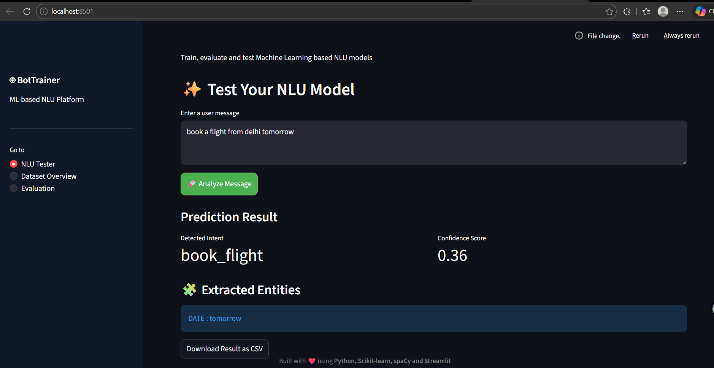
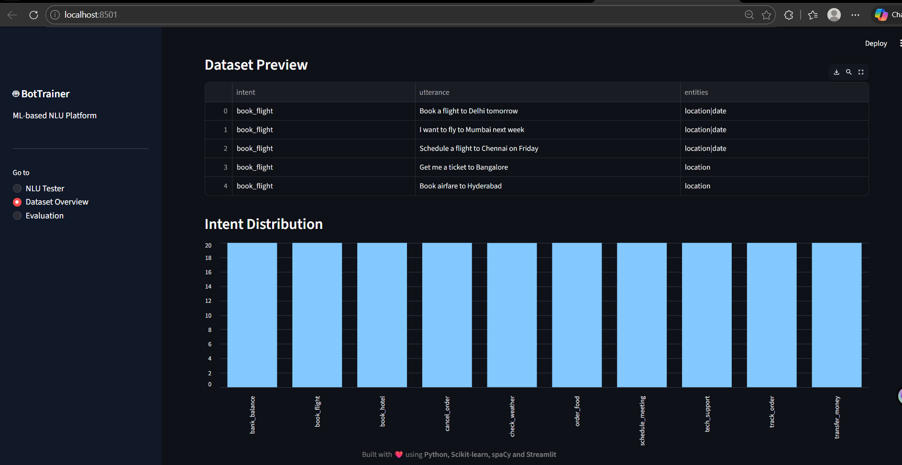
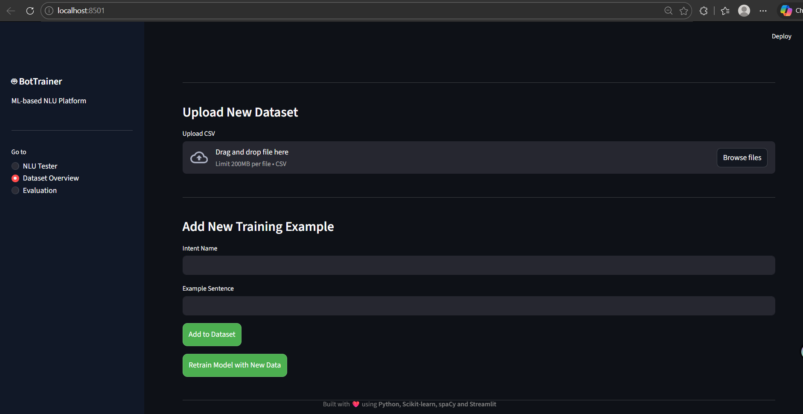
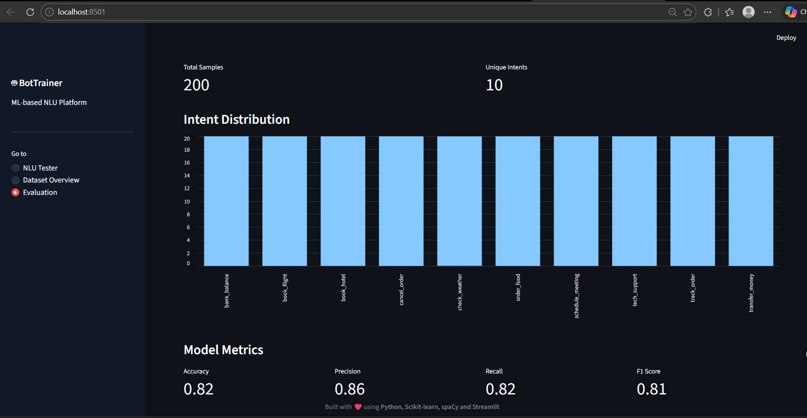
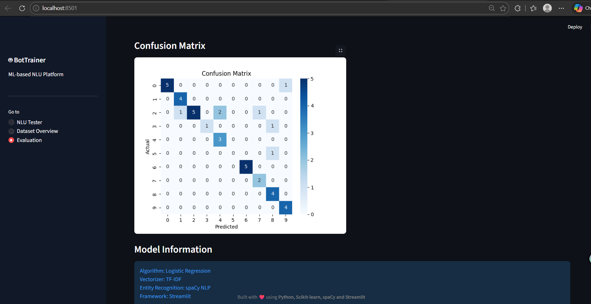

# 🤖 NLU Bot Trainer

An interactive **Natural Language Understanding (NLU) training platform** built using **Python, Scikit-learn, spaCy, and Streamlit**.

This application allows users to **train, test, evaluate, and improve chatbot intent classification models** through an interactive dashboard.

---

# 🚀 Features

✅ Real-time **Intent Classification**
✅ **Entity Extraction** using spaCy NLP
✅ **Confidence score visualization**
✅ **Dataset dashboard with analytics**
✅ Upload and train model with **custom datasets**
✅ Add new **training examples directly from UI**
✅ **Model retraining** from dashboard
✅ **Evaluation metrics dashboard**
✅ **Confusion matrix visualization**

---

# 🧠 Project Architecture

```
Dataset
   ↓
Text Preprocessing
   ↓
TF-IDF Vectorizer
   ↓
Logistic Regression Model
   ↓
Intent Prediction
   ↓
Entity Extraction (spaCy)
   ↓
Confidence Score
   ↓
Streamlit ML Dashboard
```

---

# 📷 Application Screenshots

## ✨ NLU Tester

Detect user intent and extract entities in real time.



---

## 📊 Dataset Overview

Visualize dataset size, preview data, and view intent distribution.



---

## ➕ Add Training Data

Add new intent examples directly from the dashboard and retrain the model.



---

## 📈 Model Evaluation

View model performance metrics such as accuracy, precision, recall, and F1-score.



---

## 🧾 Model Information

See details about the machine learning model and architecture used.



---

# 🛠️ Tech Stack

| Technology   | Purpose                |
| ------------ | ---------------------- |
| Python       | Core programming       |
| Scikit-learn | Machine learning model |
| spaCy        | Entity extraction      |
| Streamlit    | Web dashboard          |
| Pandas       | Data processing        |
| Matplotlib   | Visualization          |

---

# 📂 Project Structure

```
Nlu_BotTrainer
│
├── assets
│   ├── nlu_test.png
│   ├── dataset_overview.png
│   ├── evaluation.png
│   ├── add_data.png
│   └── model_info.png
│
├── data
│   └── raw_data
│
├── models
│   ├── model.pkl
│   ├── vectorizer.pkl
│   ├── metrics.json
│   └── confusion_matrix.png
│
├── src
│   ├── pipeline
│   │   ├── trainer.py
│   │   └── predict.py
│   │
│   └── utils
│       └── data_loader.py
│
├── app.py
├── requirements.txt
└── README.md
```

---

# ⚙️ Installation

Clone the repository

```
git clone https://github.com/YOUR_USERNAME/Nlu_BotTrainer.git
```

Navigate to project folder

```
cd Nlu_BotTrainer
```

Create virtual environment

```
python -m venv venv
```

Activate environment

Windows

```
venv\Scripts\activate
```

Install dependencies

```
pip install -r requirements.txt
```

Download spaCy model

```
python -m spacy download en_core_web_sm
```

---

# ▶️ Run the Application

```
streamlit run app.py
```

Then open

```
http://localhost:8501
```

---

# 🔮 Future Improvements

* Transformer based NLU models
* Chatbot interface
* FastAPI backend deployment
* Docker containerization
* Cloud deployment

---

# 👩‍💻 Author

**Kumkum Thakur**
Shoolini University

Email: [chaudharykumkum148@gmail.com](mailto:chaudharykumkum148@gmail.com)

---

⭐ If you like this project, please give it a **star on GitHub**!
